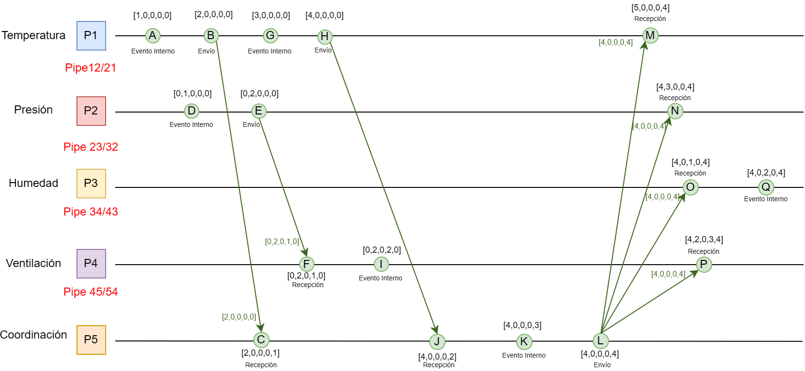

# Notas del Desarrollo Propuesto

## Entorno Propuesto
Implementar un clúster de sensores, donde cada contenedor simula tener la lógica de un microcontrolador que a su vez conecta a diferentes partes del sistema. 

Los contenedores se encontrarán aislados esperando a leer datos ambientales, sin embargo como son simulador al hacer `docker exec` indica que empiecen a generar eventos internos.

### Sistema Propuesto

El sistema debe estar propuesto por 5 procesos, de forma que se tienen los siguientes procesos:

- P1 (Temperatura)
- P2 (Presión)
- P3 (Humedad)
- P4 (Actuador - *Ventilacion*)
- P5 (Coordinador)

### Servicios de gRPC que se deben implementar

En el documento se menciona que se deben de tener 4 servicios de gRPC a implementar

#### 1.Servicio de Envío (Send)
- Parámetros: ID del que envía, ID del que recibe, el mensaje y el reloj vectorial.  
- Comportamiento: Antes de mandar la petición, el proceso emisor debe incrementar su propio reloj vectorial.  
- Registro: Se empaqueta el mensaje con el nuevo reloj vecotrial, se envía, y se guarda en la bitácora el evento de envío. 

#### 2.Servicio de Recepción (Receive)
- Parámetros: ID del que envía, el mensaje y el reloj vectorial recibido.  
- Comportamiento: Al recibir la llamada, el proceso actualiza su reloj vectorial local. Esto se hace sacando el valor máximo entre cada posición del reloj local y el reloj recibido.  
- Registro: Se registra el evento de recepción en la bitácora y se devuelve un ACK (acuse de recibo) al emisor para confirmar.

#### 3. Servicio de Evento Interno (Internal)
- Parámetros: No tendrá parámetros.  
- Comportamiento: Simula que el proceso hizo una tarea por su cuenta (leer nuestro sensor de acuerdo a nuestro escenario propuesto). Incrementa la posición de su reloj vectorial local.  
- Registro: Se registra en la bitácora el evento interno con el vector actualizado. 

#### 4. Servicio de Difusión (Broadcast)
- Parámetros: Envía un mensaje a todos los procesos del sistema.  
- Comportamiento: El propósito de este cuarto servicio es simular la difusión de mensajes, la comunicación distribuida y la actualización lógica simultánea. A nivel de código, el proceso emisor incrementa su reloj una vez por la acción de difundir, y luego ejecuta peticiones gRPC hacia todos los demás contenedores enviando ese mismo vector 

### Estructura del Escenario Propuesto del Sistema

A partir de las 4 acciones anteriores, se propone un escenario que conste:
* **Primeras Comunicaciones**: Al inicio del esecenario cada proceso simula un evento interno (lectura de sensores, calibracion, etc.) y luego se envían mensajes entre ellos para compartir información.
* **Eventos Paralelos y Alertas**: A partir de un evento (ejem. (`P1`)detecta una temperatura alta) se envía un mensaje de alerta al proceso coordinanodr (`P5`), en el mismo tiempo que (`P1`) manda la alerta, otro proceso realiza un evento interno 
* **Difusión de mensajes y Eventos de Correccción** Cuando el proceso coordinador (`P5`) recibe la alerta, difunde un mensaje a todos los procesos para que tomen acciones correctivas.

### Escenario Propuesto del Sistema

Por lo que un ejemplo de escenario propuesto podría ser el siguiente:

Donde el vector se muestra como $[P1, P2, P3, P4, P5]$

#### Paso 1: Primeras Comunicaciones

- A.P1 (Temperatura) - Evento Interno: Simula un evento interno en el proceso. P1 incrementa su índice.  `Vector local: [1, 0, 0, 0, 0]`.  
- B.P1 (Temperatura) - Envío a P5: Aquí se incrementa el reloj vectorial del emisor. `Vector local: [2, 0, 0, 0, 0]`. P1 manda este vector y el mensaje de reporte a P5.  
- C.P5 (Coordinador) - Recepción de P1: Aquí se actualiza el reloj vectorial. P5 incrementa su índice (a 1) y toma el máximo. Vector local: `[2, 0, 0, 0, 1]`. P5 devuelve un ACK.  
- D.P2 (Presión) - Evento Interno: Calibración de válvula. Incrementa su índice. Vector local: `[0, 1, 0, 0, 0]`.
- E.P2 (Presión) - Envío a P4: Notifica válvula operativa. Incrementa su índice. Vector local: `[0, 2, 0, 0, 0]`. Manda este vector a P4.
- F.P4 (Ventilación) - Recepción de P2: Recibe la notificación. Incrementa su índice (a 1) y toma el máximo. Vector local: `[0, 2, 0, 1, 0]`.

#### Paso 2: Eventos Paralelos y Alertas
- G.P1 (Temperatura) - Evento Interno: Detecta sobrecalentamiento crítico. Incrementa su índice. Vector local: `[3, 0, 0, 0, 0]`.
- H.P1 (Temperatura) - Envío a P5: Manda alerta crítica. Incrementa su índice. Vector local: `[4, 0, 0, 0, 0]`. Manda este vector a P5.
- I.P4 (Ventilación) - Evento Interno: Enciende ventiladores. Incrementa su índice. Vector local: `[0, 2, 0, 2, 0]`.
- J.P5 (Coordinador) - Recepción de P1: Recibe la alerta crítica. Incrementa su índice (a 2) y toma el máximo. Vector local: `[4, 0, 0, 0, 2]`.
- K.P5 (Coordinador) - Evento Interno: Registra la alerta en la base de datos local. Incrementa su índice. Vector local: `[4, 0, 0, 0, 3]`.

#### Paso 3: Difusión de mensajes y Eventos de Corrección
- L.P5 (Coordinador) - Difusión: Envía un mensaje a todos los procesos del sistema. P5 incrementa su índice una vez por la acción de difundir. `Vector local: [4, 0, 0, 0, 4]`. Manda exactamente este vector a P1, P2, P3 y P4 para simular la actualización lógica simultánea.  
- M.P1 (Temperatura) - Recepción de P5: Recibe la alerta de apagado. Incrementa su índice (a 5) y toma el máximo. `Vector local: [5, 0, 0, 0, 4]`.
- N.P2 (Presión) - Recepción de P5: Recibe la alerta de apagado. Incrementa su índice (a 3) y toma el máximo. `Vector local: [4, 3, 0, 0, 4]`.
- O.P3 (Humedad) - Recepción de P5: Recibe la alerta de apagado. Incrementa su índice (a 1) y toma el máximo. `Vector local: [4, 0, 1, 0, 4]`.
- P.P4 (Ventilación) - Recepción de P5: Recibe la alerta de apagado. Incrementa su índice (a 3) y toma el máximo. `Vector local: [4, 2, 0, 3, 4]`.
- Q.P3 (Humedad) - Evento Interno: Entra en modo de ahorro de energía. Incrementa su índice. `Vector local final: [4, 0, 2, 0, 4]`.

A partir del escenario descrito se tiene el siguiente diagrama de eventos:

Ya con el diagrama se pude empezar a implementar el sistema propuesto, lo primero es crear el archivo `proto` con los servicios de gRPC.

